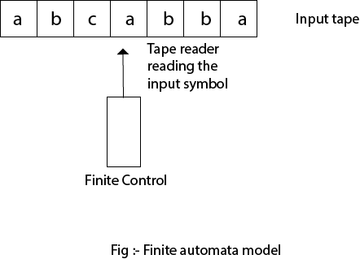

# Finite automata

A finite automaton (FA) is a simple idealized machine used to recognize patterns within input taken from some character set (or alphabet) C. The job of an FA is to accept or reject an input depending on whether the pattern defined by the FA occurs in the input.

- Q : Finite set of states.
- Σ : set of Input Symbols.
- q : Initial state.
- F : set of Final States.
- δ : Transition Function.

We execute our FA on an input sequence as follows:

- Begin in the start state
- If the next input char matches the label on a transition from the current state to a new state, go to that new state
- Continue making transitions on each input char
    - If no move is possible, then stop
    - If in accepting state, then accept

## Model

## Types of finite automata

### 1. Deterministic Finite Automata (DFA)
In a DFA, for a particular input character, the machine goes to one state only. A transition function is defined on every state for every input symbol. Also in DFA null (or ε) move is not allowed, i.e., DFA cannot change state without any input character. 

For example, construct a DFA which accept a language of all strings ending with ‘a’.
Given:  Σ = {a,b}, q = {q0}, F={q1}, Q = {q0, q1}

<table border="1"><thead><tr><th>⇣State\Symbol⇢</th><th>a</th><th>b</th></tr></thead><tbody><tr><th>q0</th><td>q1</td><td>q0</td></tr><tr><th>q1</th><td>q1</td><td>q0</td></tr></tbody></table>

### 2. Non-deterministic Finite Automata (NFA)

NFA is similar to DFA except following additional features: 

1. Null (or ε) move is allowed i.e., it can move forward without reading symbols. 
2. Ability to transmit to any number of states for a particular input.

For example, construct an NFA which accept a language of all strings ending with ‘a’.
Given:  Σ = {a,b}, q = {q0}, F={q1}, Q = {q0, q1}

<table border="1"><thead><tr><th>⇣State\Symbol⇢</th><th>a</th><th>b</th></tr></thead><tbody><tr><th>q0</th><td>{q0,q1}</td><td>q0</td></tr><tr><th>q1</th><td>∅</td><td>∅</td></tr></tbody></table>

# Push Down Automata (PDA)
Pushdown automata are nondeterministic finite state machines augmented with additional memory in the form of a stack, which is why the term “pushdown” is used, as elements are pushed down onto the stack. Pushdown automata are computational models—theoretical computer-like machines—that can do more than a finite state machine, but less than a Turing machine.

  
Diagram of a PDA

A Pushdown Automata (PDA) can be defined as : 

- Q is the set of states
- ∑ is the set of input symbols
- Γ is the set of pushdown symbols (which can be pushed and popped from stack)
- q0 is the initial state
- Z is the initial pushdown symbol (which is initially present in stack)
- F is the set of final states
- δ is a transition function which maps Q x {Σ ∪ ∈} x Γ into Q x Γ*. In a given state, PDA will read input symbol and stack symbol (top of the stack) and move to a new state and change the symbol of stack.

**Example** : Define the pushdown automata for language {anbn | n > 0}
**Solution** : M = where Q = { q0, q1 } and Σ = { a, b } and Γ = { A, Z } and δ is given by :   
δ( q0, a, Z ) = { ( q0, AZ ) }   
δ( q0, a, A) = { ( q0, AA ) }   
δ( q0, b, A) = { ( q1, ∈) }   
δ( q1, b, A) = { ( q1, ∈) }   
δ( q1, ∈, Z) = { ( q1, ∈) }   

.png>)